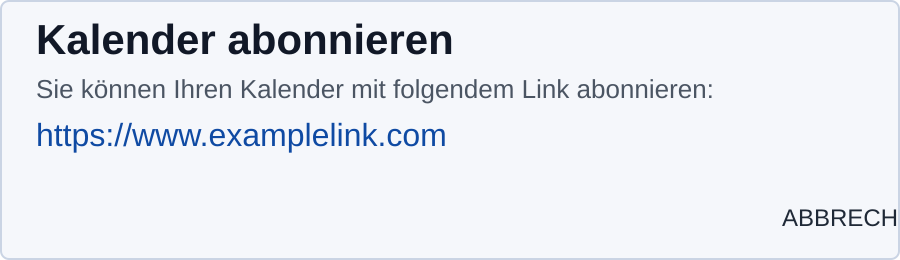

# schulNetz iCal-Link abrufen (mit Bild)

## Schritt-für-Schritt
1. In schulNetz `Agenda` öffnen.
2. `Schüler/-innenpläne` auswählen.
3. Oben rechts `Exports` öffnen.
4. `Diesen Plan im iCal-Format abonnieren` wählen.
5. Im Dialog den Link **kopieren** (nicht öffnen).
6. Link in der App unter `Einstellungen -> Kalender verbinden` einfügen.

## Beispielbild (anonymisiert)

## Wichtige Hinweise
- Nur `https://`-Links verwenden.
- Wenn der Link abläuft (z. B. HTTP 410), in schulNetz neu erstellen.
- Keine echten iCal-Links in Chats, Tickets oder Screenshots teilen.
