# Lernwelt: Design und Abnahme

Die Android-App erhält eine ruhige Lernwelt mit einheitlichen blauen Akzenten
und hellen neutralen Flächen. Der Dunkelmodus verwendet dunkle, klar getrennte Flächen.
Material-Komponenten behalten ihre Bedienung und Kontrastfarben; die vorhandenen
barrierearmen Farbpaletten bleiben erhalten.

## Bedienung

- Material-Navigation am unteren Rand mit ausgewähltem Tab und beschrifteten Zielen.
- Der Header benennt den aktuellen Bereich. Einstellungen sind über das Zahnrad
  und den dauerhaft sichtbaren Tab „Optionen“ erreichbar; Zurück führt zum vorherigen Bereich.
- Prüfungen beginnen mit einer Illustration, den Filtern und der zeitlich nächsten Prüfung.
  „Lernen planen“ ist eine beschriftete Hauptaktion. Die gewählte Sortierung gilt
  für die übrige Liste, nicht für die Auswahl der nächsten Prüfung.
- Vergangene Prüfungen bleiben in „Alle“ sichtbar, werden aber nicht als nächste
  Prüfung bezeichnet. Zeitraum und Spotlight werden alle 30 Sekunden neu geprüft.
- Suche berücksichtigt die dargestellten Titel, Fach und Raum. Erweiterte
  Filter sind einklappbar. Aktive Filter und Ergebniszahl bleiben sichtbar;
  einzelne Filter lassen sich per × entfernen. „Zurücksetzen“ löscht Datenfilter
  und behält die Listen-/Kalender-/Wochenansicht bei.
- In Prüfungen bleibt die Sortierung auch im einfachen Modus über „Filter“ erreichbar.
- Einstellungen sind nach Kalender, Darstellung, Sicherheit, Daten und Hilfe
  geordnet. Kategorien haben eigene Icon-Flächen; aufgeklappte Aktionen stehen
  als klare Zeilen mit Trennlinien in einer Gruppe. „Dein Setup“ fasst Verbinden und
  Aktualisieren zusammen. Die Suche zeigt passende Aktionen über alle Kategorien hinweg und
  versteht auch „Backup“. Bestehende Aktionen verwenden dieselben Dialoge und
  gespeicherten Einstellungen wie zuvor. Schalter sind über die gesamte Zeile bedienbar.
- Filter, Tab-Zustände und Noten-Eingaben bleiben beim Tabwechsel erhalten.
  Noten-Eingaben unterstützen Androids Wiederherstellung nach Rotation/Prozessende;
  dies ist kein dauerhaftes Notenarchiv.
- Zahlenfelder verwenden eine Dezimaltastatur. Komma und Punkt sind zulässig,
  nicht endliche Zahlen werden abgewiesen.

## Kompakte Überarbeitung

- Weniger Einleitungstext, kleinere Überschriften und Abstände. Die dekorative
  Landschaft ist 76 statt 116 dp hoch; Material-Eingabe- und Touchgrößen bleiben erhalten.
- Alle Eingaben nutzen einheitliche Konturen, Rundungen und Theme-Farben. Die
  Tastatur bietet „Weiter“, „Fertig“ oder „Suchen“; Zahlenfelder passende Zahlentastaturen.
- Stundenplan: Fach und Zeit in einer Zeile, Raum direkt darunter. Raumwechsel,
  Verschiebungen und Ausfälle bleiben beschriftet. Die Filter lassen sich einklappen.
- Die Wochenkarten sind schmaler, enthalten Räume und Änderungen und öffnen die
  aktuelle Woche beim heutigen Wochentag. Andere Wochen beginnen links am Montag.
  Unterricht am Wochenende erweitert die bisherige Fünftageansicht auf sieben Tage.
- Der Stundenplan hat eine Suche nach Fach, aktuellem oder vorherigem Raum.
  Suche und Änderungsfilter gelten in beiden Ansichten und für „Jetzt & danach“.
- Agenda: kurze Überschriften und eine kompakte Ansichts-/Filterzeile. Ein erster
  eigener Termin ist jetzt auch ohne vorhandene Kalenderdaten oder iCal-Link möglich.
  Zeitangaben wiederholen die Startzeit nicht; mehrtägige Zeitspannen behalten beide
  Daten. Ganztägige Einträge enthalten keine unnötige Mitternachtszeit. Die Aktion
  zum Aktivieren des Event-Imports bleibt bei aktivem Terminfilter sichtbar.
- Notenrechner: Ziel/Schnitt und Punktewerte nebeneinander; Kategorie-Eingaben
  öffnen bei Bedarf. Ungültige Noten und Zeilengewichte werden direkt erklärt.

## Illustrationen

`study_landscape.png` und `study_empty.png` wurden am 02.10.2026 mit ChatGPTs
Bildgenerierung eigens für diese Überarbeitung erzeugt. Die Motive sind ein
Bergpfad zur Sternwarte und eine schwebende Insel mit Notizbuch. Die Dateien
liegen unter `app/src/main/res/drawable-nodpi` und funktionieren offline.
Dekorative Bilder haben keine TalkBack-Beschreibung. Texte und Aktionen stehen
auf eigenen undurchsichtigen Theme-Flächen, nicht über den Bildern.

## Prüfen

```sh
./gradlew :app:compileDebugKotlin :app:testDebugUnitTest :app:lintDebug :app:assembleDebug --no-daemon
```

`ExamFilterPolicyTest` prüft Zeitfenster, Suche, Reset und die nächste Prüfung bei
unterschiedlichen Sortierungen. `GradeNumberPolicyTest` prüft Zahleneingaben.
`StudyWorldUiTest` rendert echte Compose-Controls mit synthetischen Daten und
prüft Hauptaktionen, Hell/Dunkel, erhöhten Kontrast sowie wiederhergestellte
Noten-Eingaben, Stundenplan-Filter, Raumwechsel, optionale Kategorien und
Tastaturaktionen. Beim Termindialog wird das Öffnen des echten Android-Dialogs
überprüft. `BlueNavigationUiTest` prüft individuelle Filterentfernung, Wiederherstellung,
Ansichtserhalt beim Reset, Import-Aktion, Einstellungs-Suche, alle Aktions-Callbacks
(einschließlich Widgets) sowie den Schalter. `TimetableFilterPolicyTest` und
`AgendaTimeLabelTest` prüfen Wochenend-Unterricht, kombinierte Suche/Status und
kompakte Zeitangaben einschließlich Mitternacht und exklusivem Ganztagesende.
Die PNGs landen unter `STUDY_UI_ARTIFACTS` beziehungsweise
`build/study-ui`. Android-QA lädt sie mit den Testberichten hoch.

Eine Geräteabnahme von Live-Sync, Benachrichtigungen, Widgets und Backup bleibt
zusätzlich nötig; synthetische Oberflächentests beweisen keine externe Anbindung.

### Tatsächlich ausgeführt am 03.10.2026

In Codex Cloud mit JDK 17, Android SDK 34 und Gradle 8.2:
**118 Tests bestanden, keine Fehler oder Skips**. Kotlin-Kompilierung,
Android-Lint und Preview-APK-Build erfolgreich; `git diff --check` bestanden.
Die Abdeckung umfasst die 60 ursprünglichen Tests, sieben Filter-/Zahleneingabe-
Regressionen, 19 Compose-Tests, fünf Stundenplan-/Agenda-Regressionen sowie 27 Widget-Regressionen.
Debug- und Preview-Lint: je 32 Warnungen, keine Fehler. APK-Build und Signaturprüfung bestanden.
Die Widget-Ansichten, Konfiguration und der lokale Kalenderpfad wurden ebenfalls geprüft;
[Widget-Überarbeitung](widget-overhaul.md) beschreibt die Abnahme und ihre Grenzen.

Maven Central lieferte in dieser Umgebung HTTP 429. Für diese lokale Prüfung
wurde ausschließlich über ein temporäres Gradle-Init-Skript Googles
Maven-Central-Spiegel verwendet. Repository-Repositories und Versionsvorgaben
wurden dadurch nicht geändert. Proxy-CA und beschreibbare Cache-/SDK-Pfade
wurden nur in der isolierten Buildumgebung unter `/tmp` eingerichtet.

Bei zusätzlichen Versuchen am 02.10.2026 wurde im Robolectric-Termindialog
versucht, Titel/Ort einzugeben und zu speichern. Auf API 28 und 33 blieb dessen
Compose-Root beim Fenster-Anhängen stehen (`AppNotIdleException`; Diagnose: `pending setContent`). Dieser zusätzliche
Ablauf ist **nicht bestanden bzw. nicht nachgewiesen**. Die bestandenen
Compose-Tests der ersten Revision enthalten deshalb eine ausdrücklich begrenzte
Prüfung des Dialog-Öffnens, keine Speichern-Abnahme. Die Rohdaten des letzten Zusatzversuchs
liegen lokal unter `artifacts/dialog-render-attempt/`; diese Grenze wird nicht als
bestätigter Produktfehler oder bestandene Live-Anbindung ausgegeben.

Die folgenden 14 Aufnahmen zeigen echte native Compose-Komponenten mit
synthetischen Daten, keine auf einem Telefon gestartete vollständige Sitzung.
Hell/Dunkel, Leerzustände, aktive Filter, Stundenplan, Agenda, Einstellungen und
Notenrechner wurden in Stichproben visuell kontrolliert. Einstellungsbilder
enthalten die echte Navigationsleiste; die übrigen Bilder zeigen die jeweiligen Tab-Komponenten.

| Prüfungen hell | Prüfungen dunkel |
| --- | --- |
| 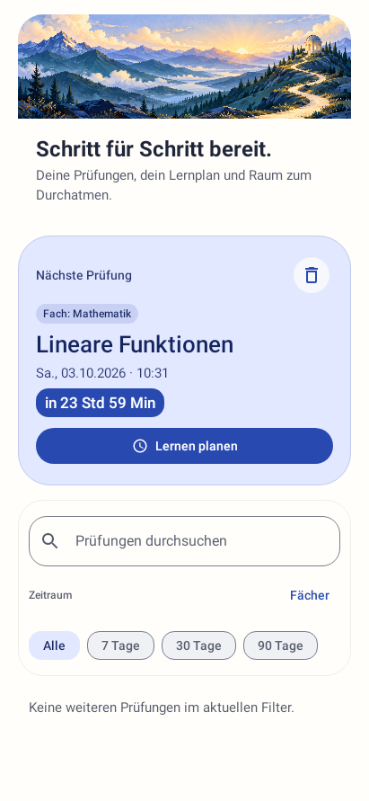 | 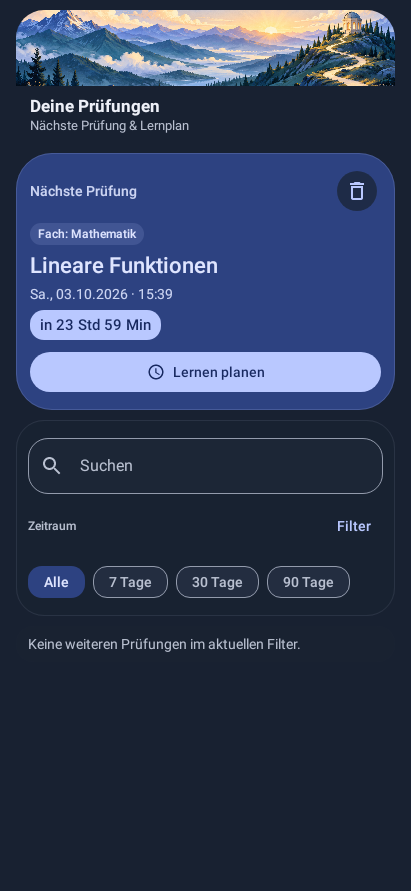 |

| Leerzustand | Notenrechner nach Wiederherstellung |
| --- | --- |
|  | 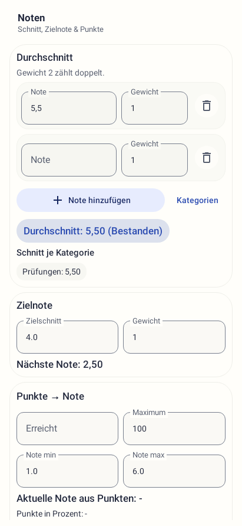 |

| Stundenplan | Wochenansicht |
| --- | --- |
| 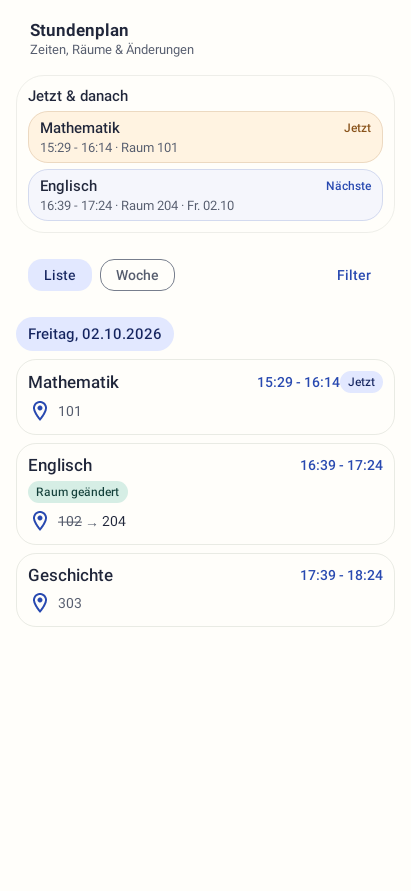 | 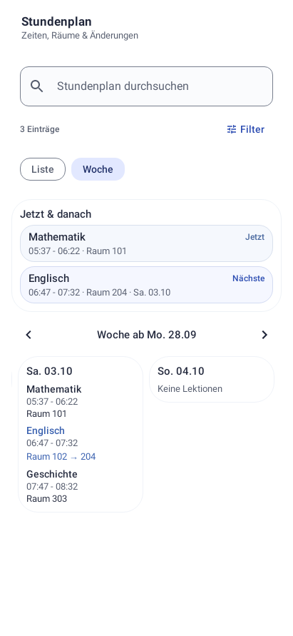 |

| Agenda | Leere Agenda |
| --- | --- |
| 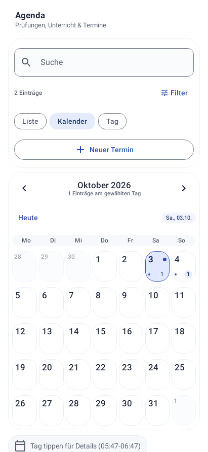 | 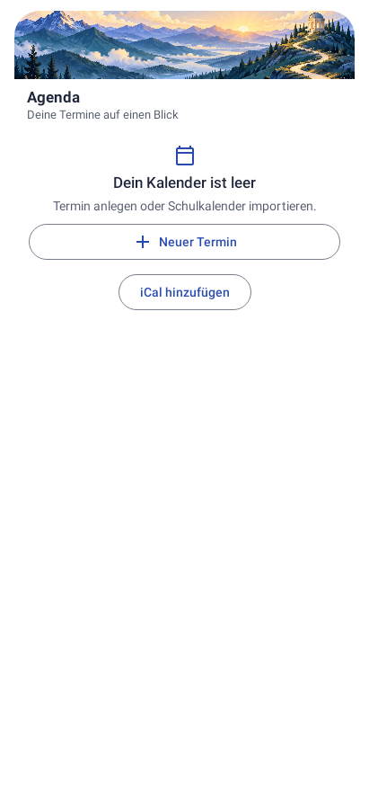 |

| Einstellungen hell | Einstellungen dunkel mit Sicherungsaktionen |
| --- | --- |
| 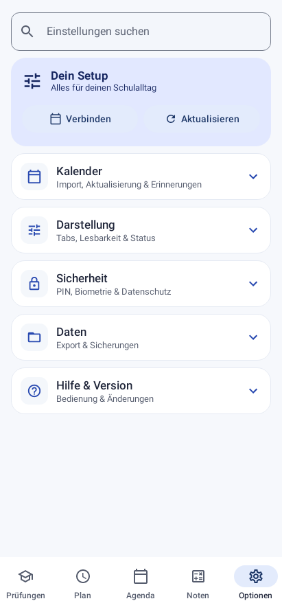 | 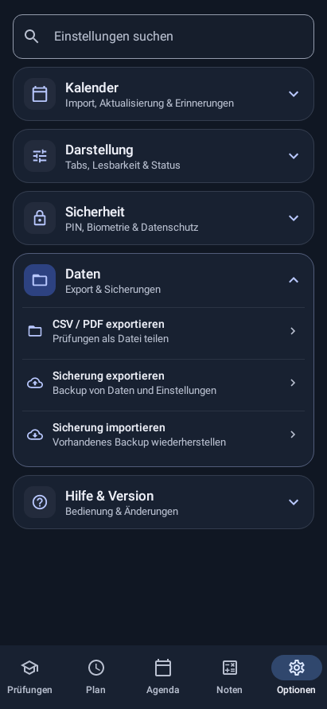 |

| Aktive Prüfungsfilter | Stundenplansuche und Raumwechsel |
| --- | --- |
| 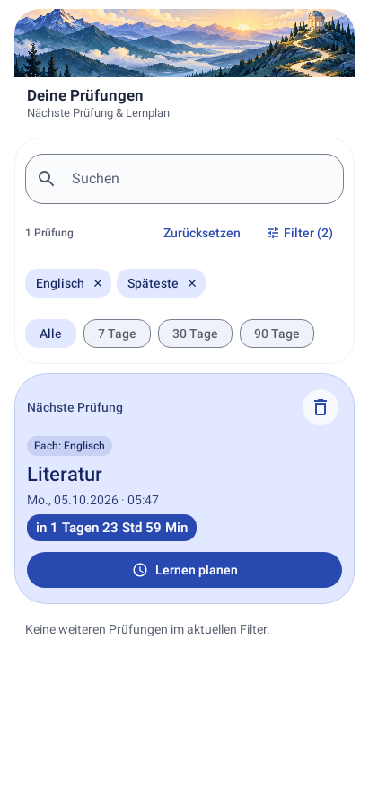 | 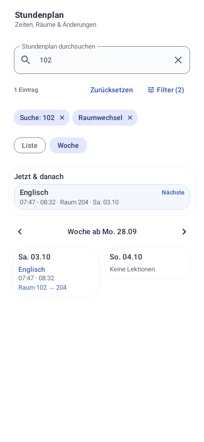 |

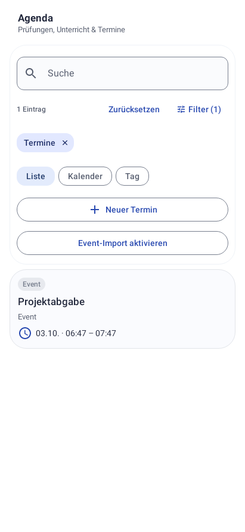

[Prüfungen mit erhöhtem Kontrast](screenshots/exams-high-contrast.png)

## gg-Arbeitsweise

Die Planung orientiert sich am `gg`-Skill aus Codex-Simple-Accounts. Der aktuelle
Cloud-Chat registriert dessen MCP-Tool nicht. Der Benutzer hat ausdrücklich eine
Simulation erlaubt. Deshalb sind dies ein manuell erstellter Arbeitsplan und
beobachtete Prüfergebnisse, keine vom Router erzeugten Scores oder nachgewiesene
Modellumschaltung. Die gg-Integration wurde nicht installiert; bestehende Skills,
Plugins und persönliche Konfigurationen bleiben erhalten.
