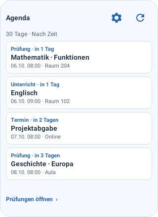
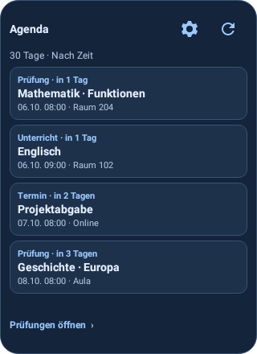
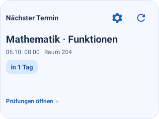
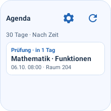
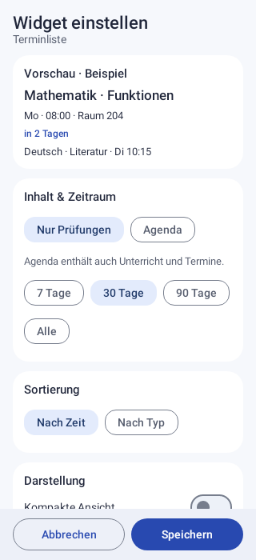
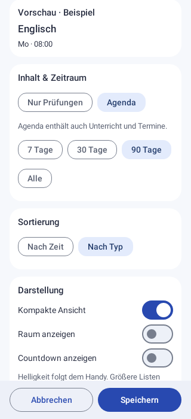
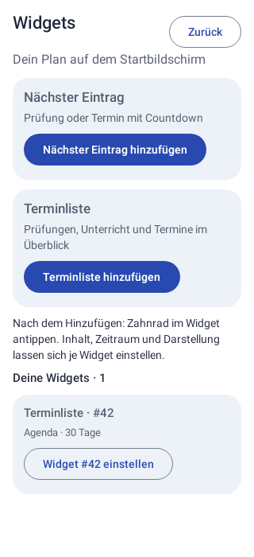
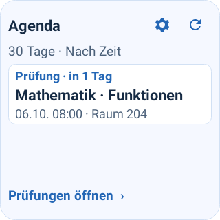

# Widgets: Gestaltung und Prüfung

Die Widget-Ansichten folgen den blauen App-Einstellungen. Androids Hell/Dunkel-
Einstellung wählt die Flächen. Große Symbole für Aktualisieren und Konfigurieren
bieten 48-dp-Touchflächen. Die Terminliste trennt Typ/Status, Titel und Zeit/Raum;
kompakte Einträge behalten den Countdown in der Detailzeile. Ein Eintrag öffnet
den passenden App-Bereich: Prüfungen, Stundenplan oder Agenda.

## Bedienung

- Zahnrad: Inhalt, Zeitraum und Darstellung dieser Widget-Instanz einstellen.
- Nur Prüfungen oder Agenda mit Unterricht und Terminen; 7/30/90 Tage oder alle.
- Die Liste kann nach Zeit oder Typ sortieren. Der nächste Eintrag bleibt zeitlich gewählt.
- Kompakt, Raum und Countdown sind unabhängig einstellbar. Bestehende Konfigurationen
  erhalten kompatible Standardwerte; andere Widgets bleiben beim Bearbeiten erhalten.
- Speichern/Abbrechen sind fest am unteren Rand; Chips umbrechen auf kleinen Displays.
- Unter `Optionen → Darstellung → Widgets` lassen sich neue Widgets anfordern
  und vorhandene bearbeiten. Launcher ohne direkte Hinzufügen-Funktion bekommen
  eine Anleitung für den Widget-Picker. Nach dem Hinzufügen dient das Zahnrad zum Einstellen.
- Größenänderung aktualisiert beide Widgets. Die Liste berechnet ihre Kapazität
  aus der kleinsten Launcher-Höhe und der Schriftgröße. Zu kleine Flächen bitten
  um Vergrößerung. Android ab API 28 unterstützt auch die erneute Konfiguration im Launcher.

## Korrigierte Fehler

Die alte Liste erzwang mindestens fünf Einträge und nahm 26 dp pro Zeile an;
die tatsächlichen Zeilen waren größer. Die neue Berechnung lässt kleine Listen
weniger und große mehr Einträge zeigen. Der nächste Eintrag ignoriert nun die
Typ-Sortierung, überspringt abgesagte Stunden und behält laufenden Unterricht.
Titel wiederholen das Fach nicht, wenn Fach und Prüfungstitel gleich sind.
Laufender Unterricht wird als „Jetzt“ statt „Prüfung läuft“ angezeigt.

Die Konfigurations-Activity ist für Android-Launcher zugänglich. Sie akzeptiert
nur tatsächlich registrierte Widgets dieser App. PendingIntents unterscheiden
Widget, Aktion und Zeile anhand eigener Intent-Daten; die früheren überlappenden
Request-Code-Bereiche können keine andere Widget-Aktion mehr überschreiben.
Alte Aktualisierungs-Intents bleiben unterstützt. Sync-Scheduling ist unverändert.

## Bestandene Prüfungen

19 neue Tests zusätzlich zu den 90 vorhandenen Tests:

- `WidgetPolicyTest` (6): nächste Auswahl versus Listensortierung, Quellen/Zeitraum,
  laufende/abgesagte Stunden, Ganztage, Raumfilter, Resize/Schriftgrößen.
- `WidgetNativeTest` (8): echte Android-RemoteViews in Hell/Dunkel, 220-dp-Breite,
  kompakte und große Schrift, tatsächliche Zeilengrenzen, Leerzustände, Navigation,
  Zahnrad, isolierte PendingIntents, alte/ungültige und getrennte Preferences,
  zugängliche Konfiguration nur für eigene Widget-IDs.
- `WidgetConfigUiTest` (4): native Compose-Konfiguration bei 320-dp-Breite,
  Wiederherstellung und gespeicherte Auswahl, Abbrechen, Hinzufügen-/Bearbeiten-
  Callbacks und Anleitung bei fehlender Launcher-Unterstützung.
- `WidgetProviderIntegrationTest` (1): echter lokaler DataStore mit synthetischen
  Prüfungen/Stunden/Terminen → Loader → beide Provider → native RemoteViews;
  Resize und Löschen einer Instanz erhalten die andere.

Alle 109 Tests sind in Codex Cloud bestanden, ohne Fehler oder Skips.
Die PNGs stammen aus nativer Android-Darstellung mit synthetischen Daten.
Ein echter Handy-Launcher, dessen Hinzufügen-Bestätigung und externer Kalender-Sync
sind damit nicht als live funktionierend nachgewiesen. Es gab keinen Emulator-
oder Handytest und keinen veröffentlichten GitHub-Release.

## Vorschauen

| Terminliste hell | Terminliste dunkel |
| --- | --- |
|  |  |

| Nächster Termin | Kleine Liste |
| --- | --- |
|  |  |

| Konfiguration | Darstellung |
| --- | --- |
|  |  |

| Widget-Verwaltung | Große Schrift |
| --- | --- |
|  |  |

Weitere native Aufnahmen: [kompakte Liste](screenshots/widget-list-compact.png),
[kompakter nächster Eintrag](screenshots/widget-next-compact.png),
[leere Liste](screenshots/widget-list-empty.png),
[nächster Termin dunkel](screenshots/widget-next-dark.png),
[Konfiguration dunkel](screenshots/widget-config-dark.png).
