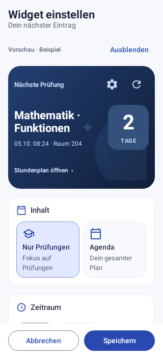

# Widgets und Einstellungen: neue Gestaltung

Die nächste Prüfung oder der nächste Termin steht auf einer dunkelblauen
Fokuskarte mit großem Countdown und dezentem Orbit-Motiv. Die Terminliste verwendet
helle beziehungsweise dunkle Flächen, eine klare Datumsspalte und ruhigere
Eintragskarten. Titel, Uhrzeit/Dauer und Raum haben eine feste visuelle Hierarchie.
Kleine Widgets zeigen eine kompakte Variante. Konfigurieren und Aktualisieren
bleiben als 48-dp-Touchflächen direkt erreichbar.

## Vorschau und Bedienung

Der Konfigurator rendert dieselben Android-RemoteViews wie das installierte
Widget. Beispieldaten zeigen jede Auswahl sofort: Inhalt, Zeitraum, Sortierung,
kompakte Ansicht, Raum und Countdown. Die Vorschau lässt sich ausblenden, um Platz
für die Einstellungen zu schaffen. Sie besitzt eine eigene Beschreibung für
TalkBack; ihre Beispielaktionen sind deaktiviert. Die normalen Widgets behalten
ihre Navigation, Konfiguration und Aktualisierung.

Inhalt wird über beschriftete Auswahlkarten gewählt. Zeitraum und Sortierung
bleiben kompakte Chips; die Darstellungsoptionen haben Icons und kurze Hinweise.
Speichern und Abbrechen stehen am unteren Rand. Auswahl und ausgeblendete
Vorschau überstehen die Android-Wiederherstellung. Die Verwaltung zeigt echte
Vorschauen beider Widgets und bearbeitet jede installierte Instanz separat.

Die App-Einstellungen erhalten „Dein Setup“ für Verbinden/Aktualisieren, eigene
Icon-Flächen je Kategorie und klare Aktionszeilen mit Trennlinien. Suche, Filter,
alle Einstellungsaktionen und der ganze Zeilen-Schalter bleiben funktional geprüft.

## Bestandene Prüfungen

**113 Tests bestanden**, keine Fehler oder Skips; Kotlin-Kompilierung und
Preview-APK-Build erfolgreich. Debug- und Preview-Lint: je 0 Fehler, 32 Warnungen.
Die APK-Signatur und Paket-/Versionsmetadaten stehen im beiliegenden Prüfbericht.

23 Widget-Prüfungen: 8 Regeln für Auswahl, Status, Größenberechnung, Countdown-
Einheiten und Zeitspannen; 9 native RemoteViews-/Preferences-/PendingIntent-/
Konfigurationsprüfungen; 5 native Compose-Tests für Konfiguration, Verwaltung und
Vorschau; 1 Integrationstest vom echten lokalen DataStore bis zu beiden Providern.
Der neue Vorschau-Test verändert Inhalt und Anzeige, prüft die tatsächlichen
Android-TextViews und verhindert das Starten von Beispielaktionen. Lazy-Listen-
Tests scrollen auch zu Elementen, die zunächst außerhalb des sichtbaren Bereichs liegen.
Die bisherigen App- und Einstellungsregressionen bleiben bestanden.

Die Aufnahmen zeigen echte native Android-Ansichten mit **synthetischen Daten**.
Handy-Launcher-Bestätigung, Benachrichtigungen und externer Kalender-Sync sind
weiterhin nicht live nachgewiesen. Der GitHub-Release bleibt wegen fehlenden
Schreibzugriffs blockiert; es gab keinen Merge.

## Fertige Ansichten

| Fokuskarte | Terminliste |
| --- | --- |
|  |  |

| Widget-Konfiguration | Darstellungsoptionen |
| --- | --- |
|  |  |

| Echte Fokus-Vorschau | Widget-Verwaltung |
| --- | --- |
|  |  |

| App-Einstellungen | Geöffnete Kategorie im Dunkelmodus |
| --- | --- |
|  |  |

| Dunkle Liste | Kleine Liste |
| --- | --- |
|  |  |

Weitere Aufnahmen: [große Schrift](screenshots/widget-list-large-text.png),
[kompakte Liste](screenshots/widget-list-compact.png),
[schmale Fokuskarte](screenshots/widget-next-narrow.png),
[kompakte Fokuskarte](screenshots/widget-next-compact.png),
[Fokuskarte dunkel](screenshots/widget-next-dark.png),
[Konfiguration dunkel](screenshots/widget-config-dark.png),
[leere Liste](screenshots/widget-list-empty.png),
[Verwaltung: Terminliste](screenshots/widget-management-list.png).
