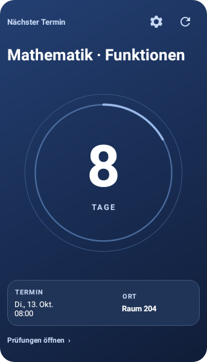
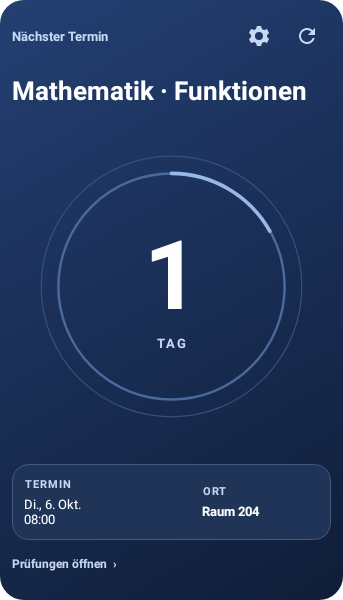
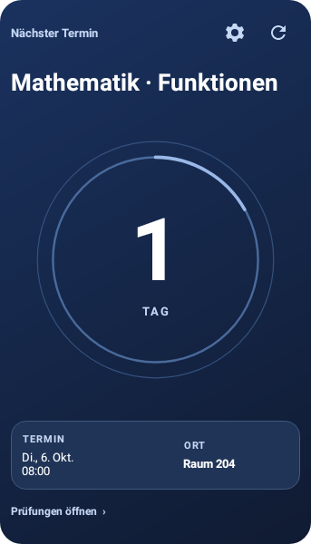
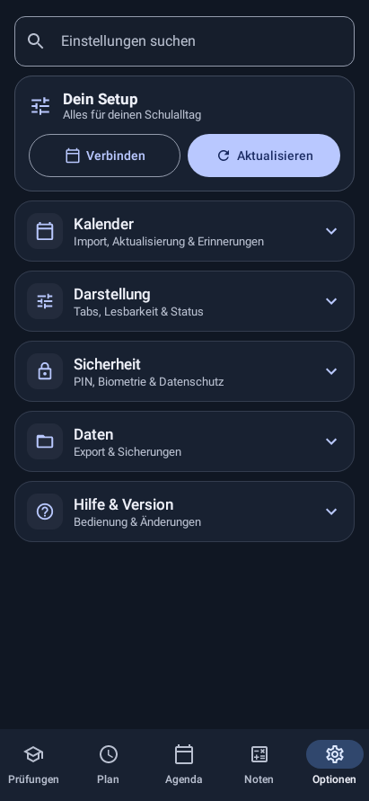

# Widgets und Einstellungen: neue Gestaltung

Die nächste Prüfung oder der nächste Termin steht auf einer dunkelblauen
Fokuskarte mit großem Countdown und dezentem Orbit-Motiv. Die Terminliste verwendet
helle beziehungsweise dunkle Flächen, eine klare Datumsspalte und ruhigere
Eintragskarten. Titel, Uhrzeit/Dauer und Raum haben eine feste visuelle Hierarchie.
Kleine Widgets zeigen eine kompakte Variante. Konfigurieren und Aktualisieren
bleiben als 48-dp-Touchflächen direkt erreichbar.

## Vorschau und Bedienung

Der Konfigurator rendert dieselben Android-RemoteViews wie das installierte
Widget. Beispieldaten zeigen jede Auswahl sofort: Inhalt, Zeitraum, Sortierung,
kompakte Ansicht, Raum und Countdown. Die Vorschau lässt sich ausblenden, um Platz
für die Einstellungen zu schaffen. Sie besitzt eine eigene Beschreibung für
TalkBack; ihre Beispielaktionen sind deaktiviert. Die normalen Widgets behalten
ihre Navigation, Konfiguration und Aktualisierung.

Inhalt wird über beschriftete Auswahlkarten gewählt. Zeitraum und Sortierung
bleiben kompakte Chips; die Darstellungsoptionen haben Icons und kurze Hinweise.
Speichern und Abbrechen stehen am unteren Rand. Auswahl und ausgeblendete
Vorschau überstehen die Android-Wiederherstellung. Die Verwaltung zeigt echte
Vorschauen beider Widgets und bearbeitet jede installierte Instanz separat.

Die gezeigte Ansicht „Nächster Termin“ verwendet jetzt einen großen, mittigen
Countdown mit dekorativem Ring. Der Titel steht darüber; darunter werden Datum
und Uhrzeit sowie der Ort getrennt dargestellt. Bei sehr großer Höhe bleiben
weitere Einträge unter „Danach“ erhalten. Hoch- und Querformat verwenden ihre
jeweiligen Launcher-Maße: MIN_WIDTH/MAX_HEIGHT im Hochformat und
MAX_WIDTH/MIN_HEIGHT im Querformat. Die kleinste Höhe einer anderen Orientierung
verhindert die große Ansicht dadurch nicht mehr. Anzahl und Anordnung
berücksichtigen die Größe und Systemschrift. Kleine,
schmale und ausdrücklich kompakte Widgets behalten ihre kompakte Ansicht.

Die App-Einstellungen verwenden jetzt neutrale weiße beziehungsweise dunkle
Flächen mit dunkler beziehungsweise heller Schrift. „Dein Setup“ setzt Blau nur
als Akzent ein. Verbinden ist umrandet, Aktualisieren besitzt eine klare
Kontrastfläche. Bei wenig Breite oder großer Schrift stehen die Knöpfe
untereinander; die Beschriftung wird nicht mitten im Wort umgebrochen. Eigene
Icon-Flächen je Kategorie und klare Aktionszeilen mit Trennlinien bleiben erhalten. Suche, Filter,
alle Einstellungsaktionen und der ganze Zeilen-Schalter bleiben funktional geprüft.

## Bestandene Prüfungen

**118 Tests bestanden**, keine Fehler oder Skips; Kotlin-Kompilierung und
Preview-APK-Build erfolgreich. Debug- und Preview-Lint: je 0 Fehler, 32 Warnungen.
Die APK-Signatur und Paket-/Versionsmetadaten stehen im beiliegenden Prüfbericht.

27 Widget-Prüfungen: 8 Regeln für Auswahl, Status, Größenberechnung, Countdown-
Einheiten und Zeitspannen; 13 native RemoteViews-/Preferences-/PendingIntent-/
Konfigurationsprüfungen; 5 native Compose-Tests für Konfiguration, Verwaltung und
Vorschau; 1 Integrationstest vom echten lokalen DataStore bis zu beiden Providern.
Der neue Vorschau-Test verändert Inhalt und Anzeige, prüft die tatsächlichen
Android-TextViews und verhindert das Starten von Beispielaktionen. Lazy-Listen-
Tests scrollen auch zu Elementen, die zunächst außerhalb des sichtbaren Bereichs liegen.
Vier neue Regressionen gegenüber beta.3 prüfen schmale Einstellungen bei großer
Schrift, hohe Widgets in Hell/Dunkel, Größen/Schriften/lange Titel und
Leerzustände beziehungsweise ausgeblendete Details. Der lokale Integrationstest
prüft zusätzlich die echte Datenauswahl der hohen Ansicht. Ein weiterer Regressionstest gegenüber beta.4 prüft die echte Android-Auswahl
der Hoch-/Querformat-RemoteViews, Countdown-Einheit und Konfiguration bei
MIN_HEIGHT 240 und MAX_HEIGHT 600. Die bestehenden Größenprüfungen kontrollieren
zusätzlich den großen Countdown, getrennte Zeit-/Ortsfelder und nicht überlappende
Elemente. Die bisherigen App- und Einstellungsregressionen bleiben bestanden.

Die Aufnahmen zeigen echte native Android-Ansichten mit **synthetischen Daten**.
Die vom Nutzer bereitgestellten Handy-Screenshots belegen das Rendering der
bisherigen App-Einstellungen und eines installierten Launcher-Widgets. Sie wurden
nicht ins Repository aufgenommen. Die neue beta.5 ist noch nicht auf einem echten
Handy abgenommen; Benachrichtigungen und externer Kalender-Sync sind hier nicht
live nachgewiesen. Der GitHub-Release bleibt wegen fehlenden
Schreibzugriffs blockiert; es gab keinen Merge.

## Fertige Ansichten

### Gezielte Änderung beta.5: Nächster Termin

[Querformat](screenshots/widget-next-launcher-landscape.png) ·
[Sehr hohe Fläche](screenshots/widget-next-extra-tall-light.png) ·
[Große Schrift](screenshots/widget-next-tall-font-1-6.png)

| Hoher Countdown | Neutrale helle Einstellungen |
| --- | --- |
|  |  |

| Hoher Countdown im Dunkelmodus | Neutrale dunkle Einstellungen |
| --- | --- |
|  |  |

[Schmale Einstellungen mit großer Schrift](screenshots/settings-narrow-large-text.png) ·
[Widget mit großer Schrift](screenshots/widget-next-tall-font-1-3.png) ·
[Einzelner Termin](screenshots/widget-next-tall-single.png) ·
[Leeres hohes Widget](screenshots/widget-next-tall-empty.png)

| Fokuskarte | Terminliste |
| --- | --- |
|  |  |

| Widget-Konfiguration | Darstellungsoptionen |
| --- | --- |
|  |  |

| Echte Fokus-Vorschau | Widget-Verwaltung |
| --- | --- |
|  |  |

| App-Einstellungen | Geöffnete Kategorie im Dunkelmodus |
| --- | --- |
|  |  |

| Dunkle Liste | Kleine Liste |
| --- | --- |
|  |  |

Weitere Aufnahmen: [große Schrift](screenshots/widget-list-large-text.png),
[kompakte Liste](screenshots/widget-list-compact.png),
[schmale Fokuskarte](screenshots/widget-next-narrow.png),
[kompakte Fokuskarte](screenshots/widget-next-compact.png),
[Fokuskarte dunkel](screenshots/widget-next-dark.png),
[Konfiguration dunkel](screenshots/widget-config-dark.png),
[leere Liste](screenshots/widget-list-empty.png),
[Verwaltung: Terminliste](screenshots/widget-management-list.png).
